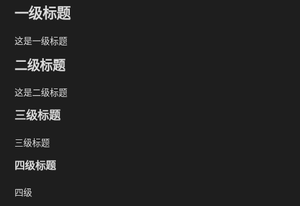

# Markdown如何快速上手

先简单介绍一下markdown，这是一种轻量级标记语言，比起格式复杂的docx等，markdown可以直接用纯文本格式编写，简单，就是它最大的优势。标记语言的意思就是，只要你使用特定的标记，那么markdown就能对特定的标记的内容进行自动渲染，下面来快速学学常用的标记吧。

## \#号

\#号是最先也是最容易掌握的，文本前加入\#和空格，就表示标题，一共可以有一至六级标题，使用方法如下

```markdown
# 一级标题
## 二级标题
### 三级标题
#### 四级标题
```

以Obsidian为例子，各级标题的效果是这样的，



同时在使用标题时，如果你的markdown笔记软件支持（应该都支持），那么你可以在软件侧边栏看到一个和word差不多的大纲。

## 图片

图片应该是使用第二多的，和word不同，由于markdown是纯文本格式，所以里面没法粘贴图片，所以markdown只能引用外部的图片，其格式如下

```markdown


```

一旦你移动了图片，markdown里的图片路径就需要跟着改，否则就会找不到图片，无法显示了。此外，一般这个路径不需要自己写，粘贴剪切板的图片时，你的markdown编辑软件一般会帮你把图片保存到特定位置，然后自动填写路径，一般也可以靠设置或者插件来设定图片保存的位置。如果使用Obsidian，那么粘贴的图片格式会是非标准的markdown格式，\!\[\[ImagePath\]\]，这个有点烦人，会导致你换个软件打开markdown就无法显示图片，可以在Obsidian设置里下一个第三方插件解决这个问题。

## 代码

对于技术爱好者而言，代码应该是和图片使用一样多的，markdown里也提供了专门的代码标签，在标签里贴代码会比在word里直接粘贴代码要美观很多，这也是广大技术爱好者都喜欢用markdown的原因之一吧，代码格式如下

````markdown
这是一个c语言代码示例，用三个反引号来包裹代码，上方的反引号右边不加空格直接写语言的名称
```c
void main()
{ return 0; }
```
python示例
```python
print "hello world"
```
一般来说上下各三个反引号就能包裹代码，不过比如这里我为了展示，内层的三个反引号不能被markdown转义，因此我的外层实际使用了四个反引号，见下图。如果你的代码块里也必须出现反引号，那么包裹你的代码块使用的反引号数量，就必须大于你内部出现的连续的反引号数量

````

这里是图，我用了四个反引号来包裹


## 转义

和编程一样，为了防止文章中的特定符号被当成markdown解析，可以使用”\\“反斜杠符号来防止转义。

## 其它标签

掌握上面的四个markdown标签，就已经能写出很漂亮的wp或者什么其他技术类文章了，其他的特殊字符还有\*星号，\_下划线，\-短横线等等，可以实现粗体斜体列表什么的；markdown也还可以实现简单的表格、引用、甚至内嵌html，可以用来更加丰富文章，就请自己研究了。

## 推荐软件

个人使用typora和obsidian，前者付费后者免费，不过obsidian会强制使用vault，就是你的md文件必须放在它的vault的位置才给你编辑，不给你随便打开一个任意位置的md文件，对新手可能会有点麻烦，而且也存在它自己定义的图片标签问题。Typora则比较通用，并且这软件早期是可以直接改它配置文件破解的，现在不知道还行不行。

## 小注

由于markdown是纯文本格式，必须要markdown编辑器才能渲染出标签，并且图片也不能移动，因此分享markdown的时候，一般是导出为pdf，再发给别人，而不是直接png、md啥的都丟给别人噢